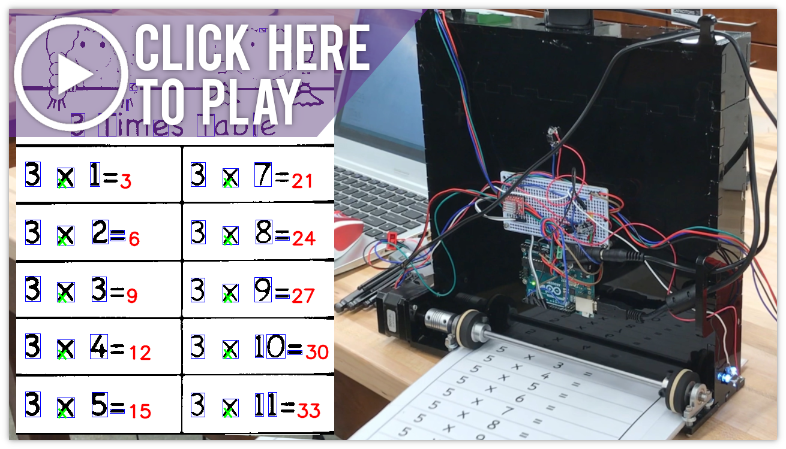
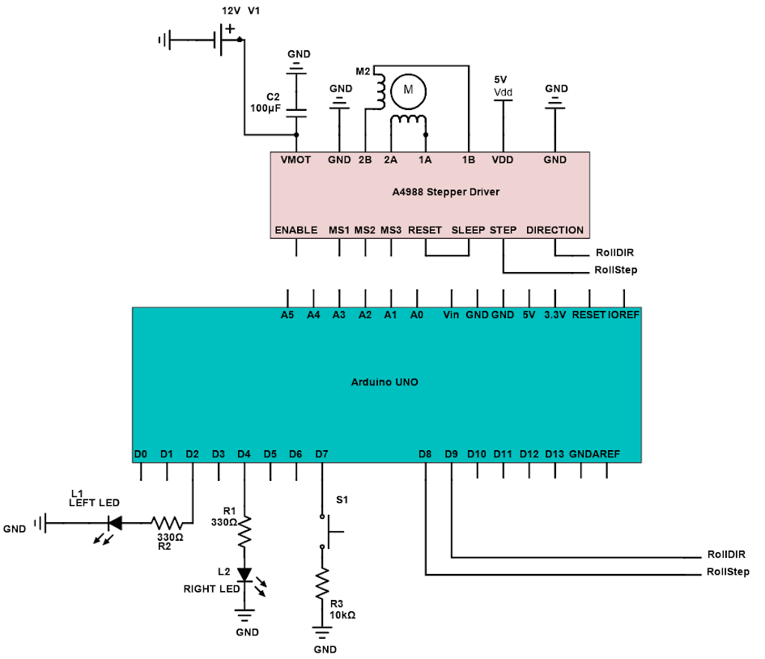
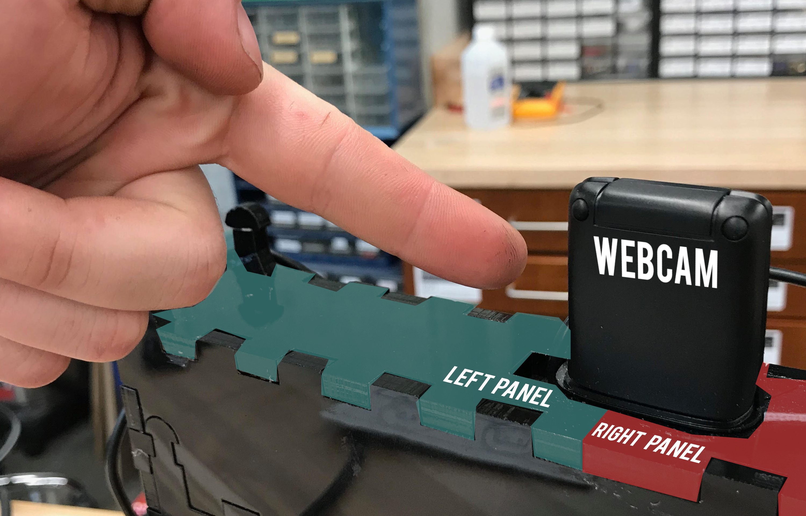
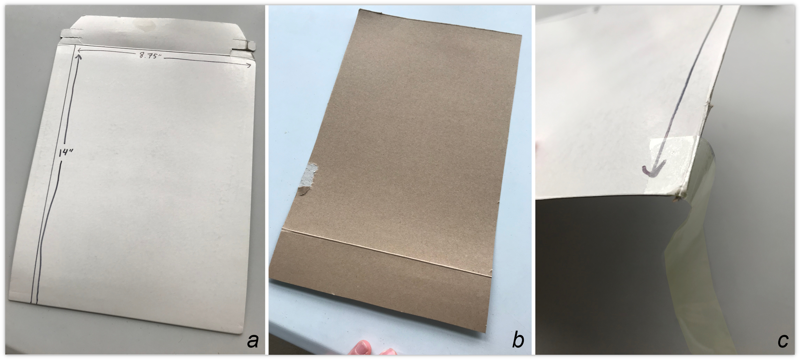
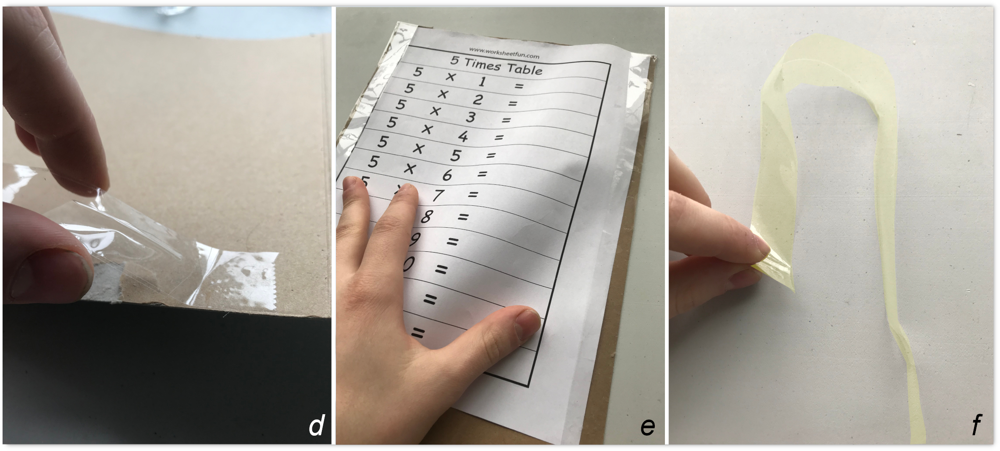

# Times Tables Homework Machine
### You wish we were friends in third grade...
---
This project aims to combine mechatronics and computer vision to solve multiplication homework. The hardware is accomplished with an Arduino microcontroller and its IDE, while serial communication invites Tesseract, an image-to-text transcription library, and OpenCV to identify math expressions to generate answers.

The concept of "times tables", where third grade students solve multiplication problems of whole numbers inclusively between 0 and 12, makes the machine's simple math capability more purposeful.

## Motivation
---
As a roboticist, comparing human capabilities to an engineered system is an exciting notion. A homework robot that is proficient in one math domain, times tables, demonstrates the basic purpose while respecting the project's ten-week deadline.

## Video Demonstration
---

## Hardware
---
The homework machine requires the following components:
* [Arduino UNO](https://store.arduino.cc/usa/arduino-uno-rev3)
* [Electronics Component Kit (5mm white LED x2, push button x1, 330Ω resistor x2, 10kΩ resistor x1, 100µF capacitor, wires)](https://www.amazon.com/REXQualis-Electronics-tie-Points-Breadboard-Potentiometer/dp/B073ZC68QG/ref=sr_1_9?dchild=1&keywords=rexqualis+arduino+kit&qid=1584594090&sr=8-9)
* [Stepper Motor Driver Module](https://amzn.to/37S7ufj)
* [NEMA17 Stepper Motor](https://amzn.to/2M3aJK2)
* [12V 2A Adapter](https://amzn.to/2nbdZ8n)
* [Power Jack](https://amzn.to/2OW3DWC)
* [Shaft Coupling](https://www.amazon.com/OctagonStar-Flexible-Couplings-Printer-Machine%EF%BC%882PCS%EF%BC%89/dp/B01HBPHSII/ref=sr_1_3?dchild=1&keywords=shaft+coupling+5mm+to+8mm&qid=1584594823&s=industrial&sr=1-3)
* [1/4" Rotary Shaft (McMaster ID: 1327K66)](https://www.mcmaster.com/catalog/126/1215)
* [Mounted Ball Bearing x2 (McMaster ID: 8600N3)](https://www.mcmaster.com/catalog/126/1301)
* [Neoprene Roller x2 (McMaster ID: 60885K46)](https://www.mcmaster.com/neoprene-drive-rollers)
* [Webcam](https://www.amazon.com/Logitech-Desktop-Widescreen-Calling-Recording/dp/B004FHO5Y6/ref=sr_1_6?dchild=1&keywords=logitech%2Bwebcam&qid=1584595653&sr=8-6&th=1)
* [Breadboard](https://www.adafruit.com/product/1609?gclid=Cj0KCQjwjcfzBRCHARIsAO-1_OrQTzhX2WaTKdnYtrHBQo3Nnivnxj5o6QlpwLbMttXioLWDhPVB_28aAjgyEALw_wcB)
* [Acrylic Sheet](https://www.jpplus.com/black-2025-extruded-acrylic?utm_source=google_shopping&m=Configurable&selected=1702&aid=1702&utm_term=&utm_source=adwords&utm_medium=ppc&utm_campaign=Shopping_CatchAll&hsa_mt=&hsa_ver=3&hsa_ad=108831781997&hsa_kw=&hsa_tgt=pla-296303633664&hsa_cam=639709174&hsa_src=g&hsa_net=adwords&hsa_acc=1076321572&hsa_grp=31980320237&gclid=Cj0KCQjwjcfzBRCHARIsAO-1_Op7FamTI0zij0-0sL7t-SXxaGU5ITJec31Pwk3zY49M9hEFP6g1mT8aAsLhEALw_wcB)
* [USB Data Sync Cable](https://www.amazon.com/Data-Sync-Cable-Arduino-Microcontroller/dp/B01N9IP8LF/ref=sr_1_1?dchild=1&keywords=arduino+usb+cable&qid=1584604166&sr=8-1)
* [Elastic Bands]()

The OnShape CAD file can be observed [here](https://cad.onshape.com/documents/e09e76b4f833341c4c3c8517/w/754831baab1776df0b796de7/e/441ad980f98b0663906cd54d)

The electric schematic can be followed below:

With the lens down and wire to the left, insert the webcam into the cavity at the machine's top by sliding the left and right panels between the camera body and clip. The panels should touch, allowing the top of the machine to be restored to a flush finish.

Since typical 8.5" x 11" paper is flimsy, a cardboard backing must be made for a smooth scan (a). Cut a [cardboard envelope](https://www.amazon.com/Quality-Park-Extra-Rigid-Fiberboard-64014/dp/B0006VPH60/ref=sr_1_2?dchild=1&keywords=cardboard+envelope&qid=1584608015&sr=8-2) to 8.75" x 14" (b). Cut two 11" strips and two 12" strips of invisible transparent.

Marry the adhesive side of each short piece to the middle of the adhesive side of a long piece, using the edge of a table to guide the tape straight and to avoid air bubbles. Attach a 1/2" sticky end of one tape pair to the top, right-side, white edge of the board and fold it over to the brown side, adhering the second sticky end with the tape ribbon fully extended(c)(d). Repeat for the remaining tape pair for the the top, left-side, white edge.

Liberally tape the ribbons' sides to the cardboard with more invisible tape. A worksheet can now be easily inserted and removed, using the tape as guide rails(e)(f).

## Getting Started
---
### Requirements
The code files require:

1. [Arduino IDE](https://www.arduino.cc/en/main/software)
2. [Python](https://www.python.org/downloads/)
3. [Numpy](https://scipy.org/install.html)
4. [OpenCV](https://opencv.org/releases/)
5. [Pytesseract](https://tesseract-ocr.github.io/tessdoc/Downloads)
6. [Serial](https://pypi.python.org/pypi/pyserial)

Before trying the required software and libraries, run the following from terminal:
`$ sudo apt update`

`$ sudo apt upgrade`
#### 1) Arduino IDE
`$ sudo apt-get install arduino`
#### 2) Python
`sudo apt install python2.7 python-pip`
#### 3) Numpy
`$ sudo apt install python-numpy`
#### 4) OpenCV
`pip install opencv-python`
#### 5) Pytesseract
`$ sudo apt-get install tesseract-ocr`

`$ git clone https://github.com/tesseract-ocr/tessdata.git`
## Setting Up the Code
---
### Arduino UNO
Run `$ arduino` from terminal to open the IDE. Next, click `File > Open` and select `homework.ino` from your File Explorer. For future contribution, functions and pins for a potential pen mechanism are harmlessly included.

Connect the microcontroller to the computer via the data sync cable. From the upper toolbar, click `Tools > Board > Arduino UNO` followed by `Tools > Serial Port` where the available port can be selected. In cases where more than one port is proposed, consult [this](https://www.mathworks.com/help/supportpkg/arduinoio/ug/find-arduino-port-on-windows-mac-and-linux.html) document from MathWorks.

Upload your code by clicking the rightwards arrow. Now onto the Python code!
### Python
Open `homework.py` in an IDE compatible with Python.

For the following line, modify the first parameter to match the serial port set in the Arduino IDE.

`arduinoSerialData = serial.Serial('/dev/ttyACM0',9600)`

Similarly, on the line below, change the device number between parenthesis to match your webcam's device number. If your computer has a built-in webcam, `(2)` will likely be correct for the machine's Logitech webcam. Writing `(0)` would be the next best option, followed by `(1)` or `(3)`.

`cap = cv2.VideoCapture(2)`

For people planning to use the python code without building the machine, close the code starting with `arduinoSerialData = serial.Serial('/dev/ttyACM0',9600)` and reaching until `cv2.imwrite('limages/sheet.png', sheet)` with three double quotation marks at each end.

## Running the Machine
---
Ensure the Arduino IDE remained open and connected to the same serial port. From terminal, enter the directory of the folder with `homework.py` and run the code by typing the following

`$ python homework.py`

Ensure that the Arduino UNO and 12V wall wart are connected to the computer and breadboard, respectively.

To start operating, slide the worksheet into its cardboard backing. Place the top edge of the worksheet between the wheel and base of the machine. Press the push button and marvel at the machine scanning the worksheet. A four second delay separates each ninth of the paper for the webcam to process the image.

After image processing time and motor movement, a digital photocopy will appear in a new window revealing the answer key in under a minute (unless one's computer is abnormally slow). To scan another worksheet, only restarting the python code is necessary.

## Academic Honesty
---
Recreating this machine in honor of being the coolest older sibling/relative/neighbor/parent for enabling a lucky third grader to plagiarize is not cool. As someone who was caught plagiarizing a Romeo and Juliet English assignment in ninth grade, I insist that learning this lesson the hard way is highly undesirable. Conversely, using this project to enrich mechatronics and computer vision skills is definitely cool.
