# Schedule
## Week 9: Final Week & COVID-19 Intervention
---
### Goal
1. Finish the Machine!

### Final Touches
As mentioned in week 8, breaking a double stranded chain was expected to be difficult. It was achieved with the unexpected but crucial help of a vise, and the machine was assembled to mechanical perfection.

Unfortunately, everything went downhill from here. Soldering the second and third motors looked like a smooth experience, but running the Arduino code revealed that the first motor always worked, the second rarely worked, and the third one never worked. The investigative skills of Joshua Cohen also found no apparent issues, besides my NEMA17 motors getting hotter than he knew those motors could. I am accustomed to the motors' heat from passion projects, so I doubt that led to the irresponsive motors.

Meanwhile, cancellations regarding COVID-19 were intensifying to the point where the lab was closed the day after. I shockingly took no photos of my mechanical pen mechanism, but will gladly do so during the spring quarter if requested to.

## Week 8: Pen Mechanism
---
### Goals
1. Buy hardware
2. CAD the pen mechanism
3. Assemble the pen mechanism

### Hardware
For the machine, the following hardware was purchased:
* [Double Stranded Roller Chain](https://www.amazon.com/gp/product/B00NP5K1WO/ref=ox_sc_saved_title_1?smid=A1JFFMF6BJ7BL9&psc=1)
* [Chain Sprockets x2 (McMaster ID: 2784K16)](https://www.mcmaster.com/catalog/126/1172)
* [1/4" Dia. Rotary Shaft (McMaster ID: 1346K17)](https://www.mcmaster.com/catalog/126/1214)
* [1/2" Dia. Rotary Shaft (McMaster ID: 1327K66)](https://www.mcmaster.com/catalog/1327K66)
* [4mm Dia. Linear Motion Shaft (McMaster ID: 6112K12)](https://www.mcmaster.com/catalog/126/1209)
* [Mounted Ball Bearings x2 (McMaster ID: 8600N3)](https://www.mcmaster.com/catalog/126/1301)
* [Shaft Couplings x2](https://www.amazon.com/OctagonStar-Flexible-Couplings-Printer-Machine%EF%BC%882PCS%EF%BC%89/dp/B01HBPHSII/ref=sr_1_3?dchild=1&keywords=shaft+coupling+5mm+to+8mm&qid=1584705978&sr=8-3)

### CAD Part 2
The OnShape CAD file can be observed [here](https://cad.onshape.com/documents/3b571bb579497f4e8f77906e/w/96829a41440a358d68533fb0/e/7e34af11bbcd2e83f3bb450c).

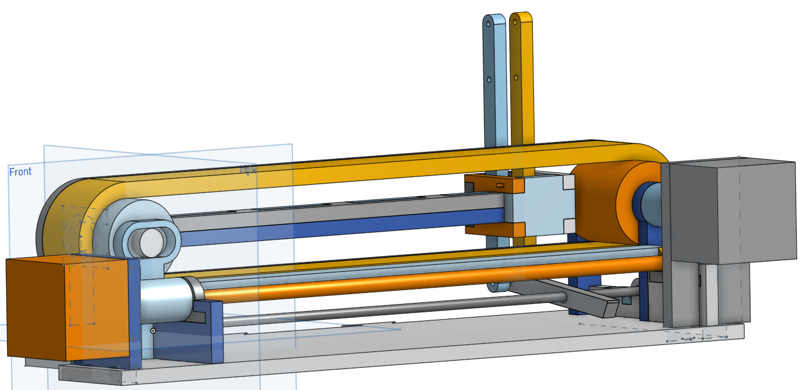

### NEXT WEEK: Assemble the Pen Mechanism
Can the engineer finish off half of the machine in a week's time? With two of his four credits' finals exams behind him, he has hope. It will start with finding a chain breaker to break a double stranded chain...
## Week 7: Improving the Reading Accuracy
---
### Goals
1. Fix the reading accuracy
2. Figure out what to do with 2 weeks left

### Highly Effective Image-to-Text Readings
By actively returning visual, bounding boxes around each found character, I was able to realize an amazing page segmentation method that I had not considered before. The page segmentation method is exceptional because context clues, which would be helpful for reading words, are disregarded, returning every character I desired. The method sadly did not return the characters in order, but I was able to make a simple sorting algorithm that respected the context of a math worksheet. From here, the following worksheets were easily answered by my code.
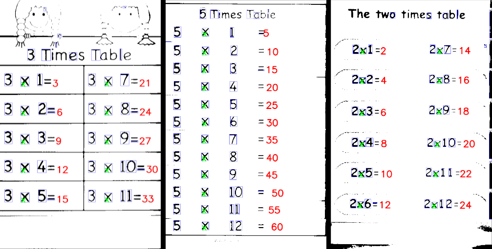

### NEXT WEEK: Pen Mechanism
Of all the ways to advance the project with two weeks before the deadline, building and programming the pen mechanism will be ventured out on in the name of making the project look maximally stunning. First things first, it is time to fire up OnShape and start ordering from McMaster.

## Week 6: Fixing the Wheel Height. So Fun.
---
### Goals
1. Perfect the wheel height for effortless scanning
2. Data Training/ML/PyTorch for Reading Accuracy

### Wheel Height
Who would think that adjusting wheel's subtle heights would keep me victim in the lab for late nights? Thankfully, the height was perfected the evening before the project's weekly meeting, which entailed using .005" shimming. It was such a precise operation, in fact, that the bearing block by one wheel had a shimming layer more than the other per a height difference not visible with the human eye, or at least with my eyes paired with a powerful eyeglass prescription.

Best of all, the neoprene rollers are so exact that simple concatenation yield very proficient results! No need for a splicing algorithm! Look at the perfection below!
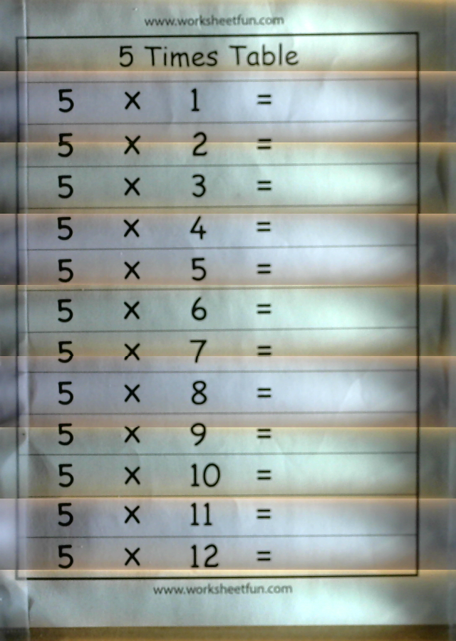

### NEXT WEEK: Finally Make Reading Accuracy Competent
There is no beating around the bush now: machine learning or some training is necessary. In the honor of mechatronics and everyone's inner child wishing a homework machine would exist, I will do what I must do for the worksheets to be read accurately.
## Week 5: Hardware Week
---
### Goals

1. Read the A4988 (stepper driver) Datasheet
2. Schematic Take 2
3. Move from Solderless to Solder
4. Non-LEGO Assembly

### Understand the Stepper Driver
After studying a datasheet on my A4988 stepper driver, its pin's purposes are summarized:
* MS1 to MS3: Leaving these three microstep selection pins disconnected results in full-step mode (setting certain ones high allows ½, ¼, ⅛ and 1/16 stepping)
* 1A-2B: The 1’s are one coil, The 2’s are another coil
* VDD & GND: Fueled by Arduino’s 5V and GND, respectively
* VMOT & Nearby GND: Connect to motor power supply; capacitor smooths out voltage spikes
* DIR & STEP: DIR determines CCW or CW rotation, Arduino sends a pulse for each microstep
* SLEEP: Minimizes power consumption when motor is not in use
* RESET: Resets pin to predefined home state (SLEEP brings it high, enabling the board)
* ENABLE: Left at “0”; disabled if set HIGH
Operates from 8 – 35V and can deliver up to 2A per coil
* Short-to-ground and shorted-load protection
* The current must actively be limited to under 1A to prevent damage to the motor

#### Redo the Schematic
Not only were the tangled wires of the last schematic burdensome to follow from pin-to-pin, but confusion over the plausibility of the circuitry was addressed with the cleaner schematic, shown below.
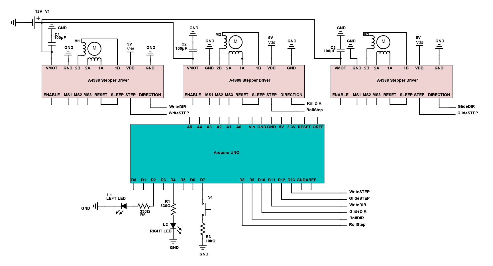

#### Soldering
It was a careful process, and though I ended up destroying one driver and a breadboard, the second run went flawlessly. I did not solder drivers or motors that were not part of the scanning portion of the machine.
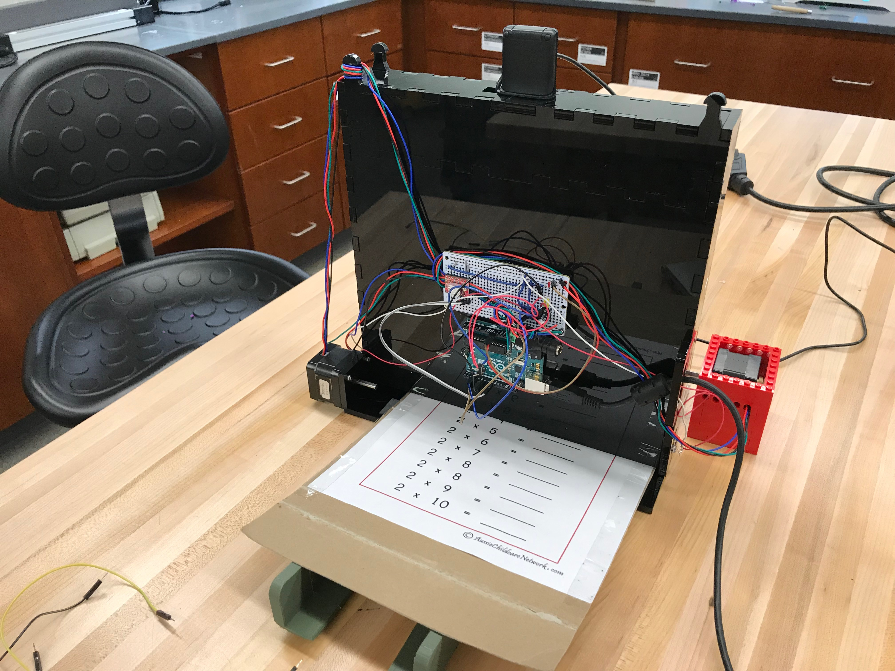

#### NEXT WEEK: Finish the Non-LEGO Build
Assembling the acrylic panels was easy. However, setting the wheels' heights to suck in the paper without slippage nor excessive friction is so challenging, that it could be my only goal for this project next week. Click below to watch my dissatifaction with the small yet critical issue.

## Week 4: CAD Model & Reading Accuracy Continues
---
### Goals:
1. Create a CAD model for the scanning half of the machine
2. Continue improving image-to-text accuracy

CAD Model
A CAD model was designed to suck in the paper, scan it, and host all the hardware and circuitry for this half of the machine. The OnShape CAD file can be observed [here](https://cad.onshape.com/documents/e09e76b4f833341c4c3c8517/w/754831baab1776df0b796de7/e/441ad980f98b0663906cd54d).

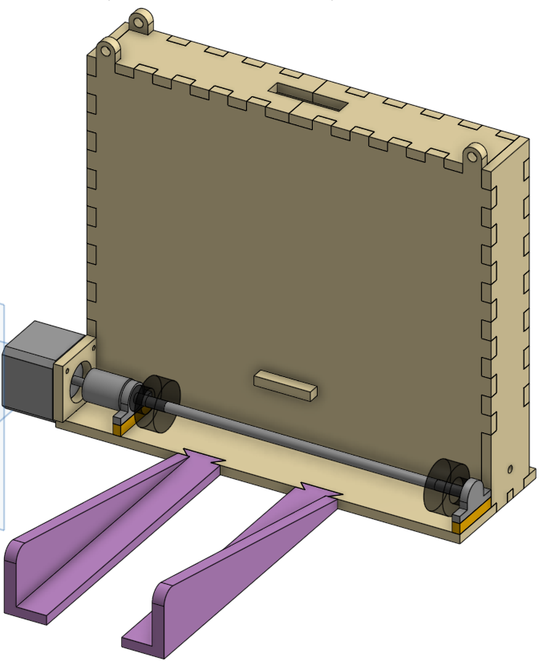

### Improve Accuracy of Readings
Minimal testing revealed worksheets with multiple problems written per line are read less accuracy than the earlier one-per-line worksheet being used. Instead of continuing with accuracy for another consecutive week, we will detour next week for similarly purposeful objectives.

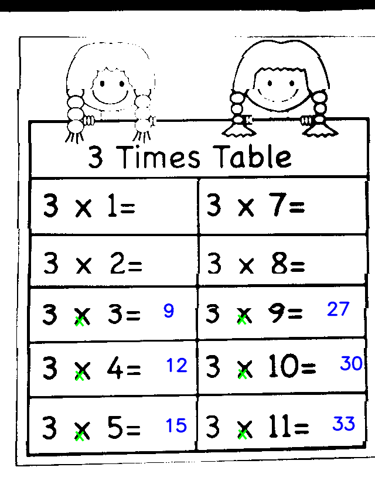

### NEXT WEEK: Improve Electrical Components Knowledge
Since I blindly followed YouTube tutorials for setting up my motors and because my electrical engineering background is elementary, it was encouraged that I study my stepper driver of choice and create a more elegant version of my earlier schematic for the machine's circuitry, respectively.
## Week 3: Perfect the CV Readings
---
### Goals
1. Improvement via Splicing
2. Improvement via Tweaking Tesseract

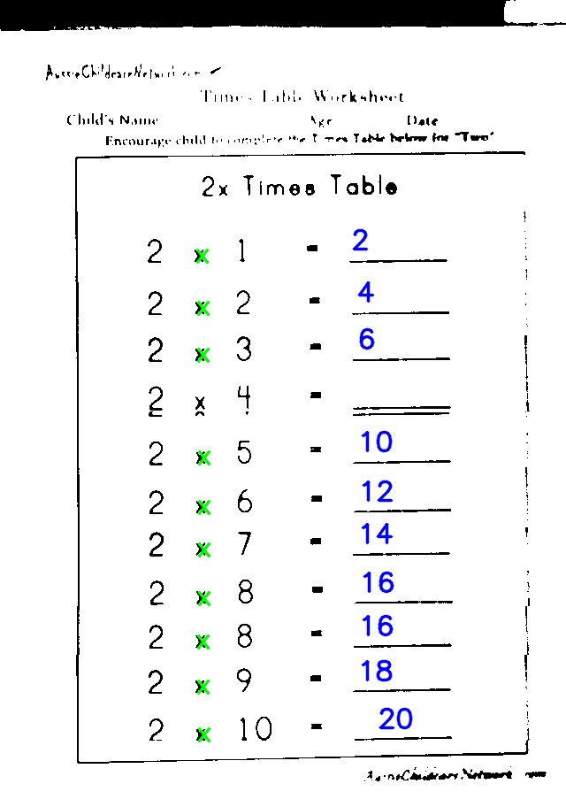
### Splicing
While I tried using a splicing function directly from OpenCV, the worksheets were too sparse in detail that the function yielded worthless results. Consequently, I created an algorithm that concatenates neighboring scans at a region where they share a similar amount of white pixels. While the returned results are decent, not enough tests were run to confirm the results were better than plain concatenation with Numpy.

### NEXT WEEK: Tweaking Tesseract
As it turns out, Tesseract cannot detect flagged 4's by virtue of being made for typed characters. Clever workarounds, like flipping the image and looking for upside down "h" characters or even searching for the Russian symbol "ч" failed. To solve the issue, machine learning or training Tesseract will likely be adopted next week.

## Week 2: First Schematic Draft and Code Tweaking
---
### Goals
1. Circuit Schematic
2. Find Final Answer Coordinates
3. Increase Tesseract Accuracy

### Circuit Schematic
The below schematic was made possible by Digikey's Scheme-it: an online schematic tool.

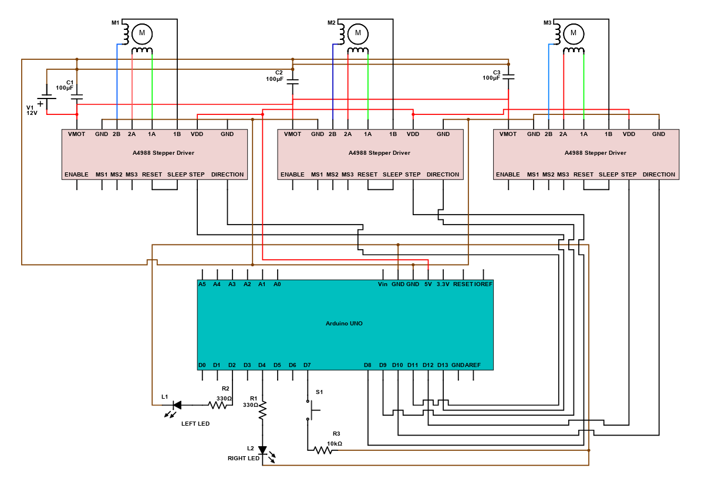

### Find Final Answer Coordinates
Per the below scan, my code was able to deduce where the appropriate places to write the answers were. However, reading errors remain, like `2x3` being misread as `9x3` and unflagged 4's proving difficult for Tesseract.

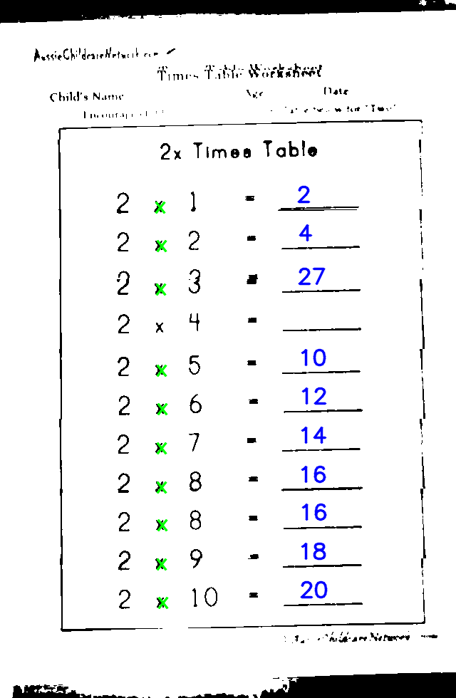

### NEXT WEEK: Increase Reading Accuracy
While improving Tesseract's analysis skills is a challenge of unknown rigor, starting by stitching together the nine photos that make up a worksheet more effectively is a good place to start. We will see if it lended itself significantly to next's week's progress.

## Week 1: The Prototype
---
### Video Summary (Click Below to Watch)

### Goals
---
1. Reassembling the prototype after transportation

2. Figuring out how to make the machine more "from scratch" mechatronically

#### Reassembly
---
After returning from vacation, the machine had to be restored to its condition before its turbulent plane ride. The matter was a simple as deducing which piece filled which gap, and before you know it, the mechanically working prototype was standing on Northwestern territory.

The machine works as follows. First, a user places a worksheet by the wheels, where pressing a push button causes the paper to be sucked in (right). Wheels allow the webcam to photograph/scan the entire paper, and the wheels also contribute to vertical movement for writing. A second degree of freedom is enabled with a conveyor belt, which is attached to the pen and allows it to slide horizontally on the paper (middle). The third degree of freedom is granted by a third motor twisting a yellow cam, in turn moving a seesaw that lifts and lowers the pen on paper (left).
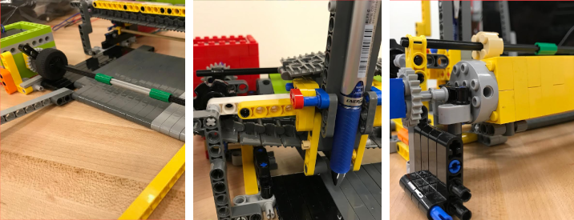

The Arduino IDE is limited, so it is exclusively programmed to suck a paper in a fixed distance and write seven segment numbers depending on which functions are called. For instance, four digits of my friend's number were written by calling functions `number5();`, `number3();`, `number1();` and `number9();` in succession.

The python code listens to the Arduino's serial messages as queues of when to take photos, which are used to concatenate different scans into a digital worksheet. The image is passed through Tesseract, an image-to-text library, that detects numbers and "x" characters, per my requirements. Early, promising signs of the multiplication were presented!

### NEXT WEEK: Engineering Something "From Scratch"
---
Between creating my own machine learning algorithm to detect numbers and recreating the machine without LEGO, the latter appealed to my ambition for higher automation knowledge. How to build without LEGO will be explored next week.
